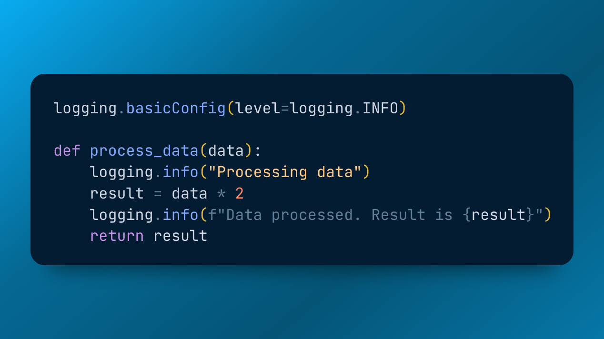
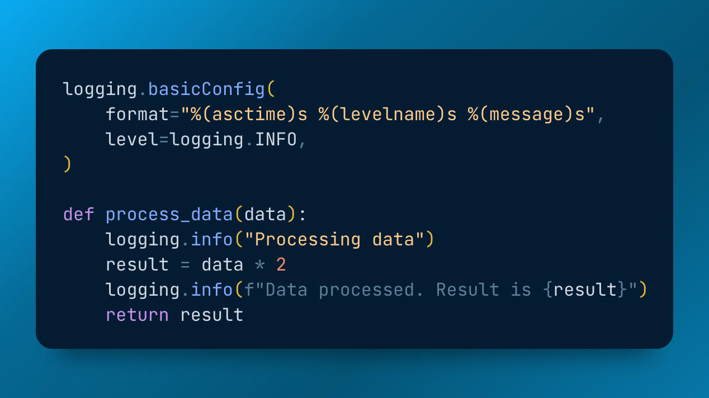

# Logging in Python

# Why? When? And How?

PyCon PL 2023\, Vagiz Duseev

Vagiz Duseev

@vduseev

vagiz@duseev\.com

# Why logging is a problem?

First\, it starts very simple

Gets more complicated over time

Adds more overhead in production

Becomes crucial during incidents

Turns into a headache at large scale and distribution

# It starts simple

_Let’s take a look_

# How about a timestamp?

_Let’s take a look_

# Let’s get logging

_Let’s take a look_

# Give me my timestamp back

_Let’s take a look_

# Let’s try something else

_Let’s take a look_

# Managing logging in other modules

_Let’s take a look_

# Logging to a file

_Let’s take a look_

# Files need rotation

_Let’s take a look_

# Your honour, objection!

Who rotates the log if the program stops?

How are we going to update rotation config?

What if logs occupy all space on the disk?

# Files need rotation

# Log search

Just  __grep__  itgrep –i “192\.168\.2\.3” my\-logs\.log

What if it’s archived?zcat my\-logs\.5\.tar\.gz | grep –i “192\.168\.2\.3”

Grep with regex? Grep not through terminal? Aggregate? Regex?

# Let’s add indexationElastic / Splunk / Graylog / …

# Configure handler

# Still configuring handler …

# Same processing

_Let’s take a look_

# Big brain time

Logging config to control every aspect

Docker daemon drivers

FluentD for log collection

Let’s take a look

# Perfect system

* Open source
* Stores logs\, metrics\, and traces
* Tailored for
  * Lots of writes\, small number of reads
  * On the flight analytics for alerting
  * Timeseries: all data has a timestamp
* Horizontally scalable
* Does not require running instances \(except for alerting\)
* Does not require schema to be defined upfront
* Agnostic to underlying storage

# This concludes: Logging in Python

github\.com/vduseev/python\-logging

@vduseev

vagiz@duseev\.com

